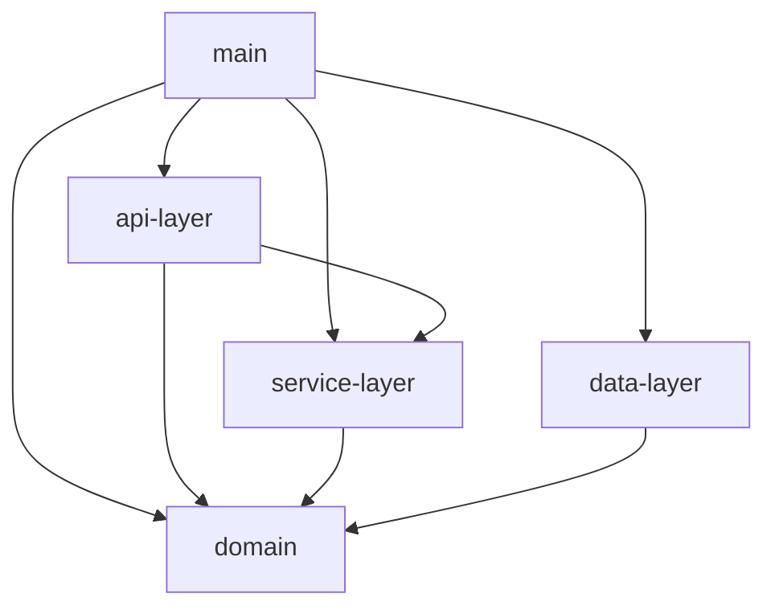

# Little games

## General information

Little games - soon to be a collection of different simple games APIs.
Games:
   - [x] Bulls and Cows

### Bulls and Cows

In this game your objective is to guess a word, hidden by system, using similar structured words and having in return amount of "Bulls" and "Cows" in your guess, where "bulls" are letters that belong to both hidden word and your guess and have same index in both, amd "Cows" are letters that belong to both hidden word and your guess, but have different indexes. 

For reference - consider it a Wordle, but without information on which letter is green and which is yellow, just the amount of each.

#### Game modes

- [x] Single-player vs Computer
- [ ] Multiplayer: fastest wins
- [ ] Multiplayer: step-by-step

## Project structure

Module `api-layer` consists of endpoints and other interfaces, for service to be accessible and respective controllers.

Module `data-layer` consists of data access objects, such as database repositories or another backends http repositories. 

Module `domain` just contains business data-classes and some generic utils

Module `service-layer` consists of services - objects, that perform main logic. There are two types of services there - application services and domain services. Domain services are those, which contain almost exclusively pure functions, do not have any state and just perform business logic. Application services perform complex logic of routing or caching etc.

Module `main` is just convenient entry point - everything is interconnected and built there.

### Module dependencies graph

